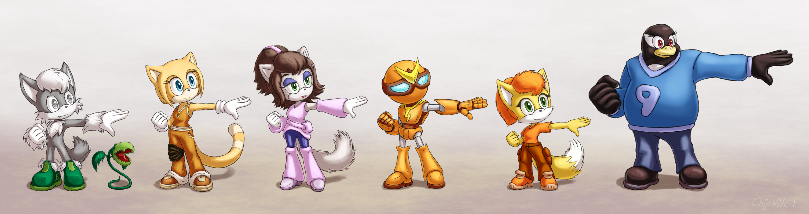
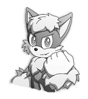
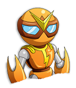
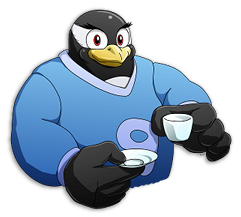
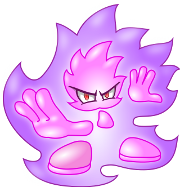

# Персонажи

## Основные персонажи

---

### Albert the Wolf

**Имя**: Альберт

**Прозвища**: Вундеркиндер, Эйнштейн

**Возраст**: 8 лет

**Пол**: мужской

**Рост**: ниже среднего

**Раса**: волк

**Телосложение**: посредственное

**Основной окрас**: серый, светло серая шерсть на руках, ногах, на груди
и в области волос на голове

**Цвет глаз**: серый (зрачки тоже серые)

**Основная одежда**: зелёные ботинки

**Характер**: спокойный, сконцентрированный

**Сверхсилы**: частичная или полная невосприимчивость к многим ядам 
и, соответственно,  лекарствам
 
**Интересы**: биохимия, токсикология, агрономия, пиротехника
 
**Роль**: лекарь

**Семья**: неизвестно

**Любит**: выращивание и изучение экзотических растений

**Интересные факты**:
- Не имеет прямого отношения к исследовательской лаборатории.
- Имеет лично созданного хищного питомца-растение-симбиота по имени Граб 
и единственный кто может продолжительное время носить его без негативных 
последствий для себя.
- Обладает слабым цветовым зрением.
- При взаимодействии с Грабом способен на короткий промежуток времени
значительно наращивать свою мышечную массу, силу и стойкость.
- Кроме экзотики выращивает и обычные овощные культуры в теплице 
на склоне горы, тем самым снабжая свежей провизией себя и остальных.
- Основным оружием является Граб.

[**--- Галерея ---**](https://claudiabot.org/gallery/thumbnails.php?search=albert&album=search&newer_than=&older_than=&keywords=on&type=AND)

---

### Ela the Cat

**Имя**: Ила (Эла)

**Прозвища**: -

**Возраст**: 16 лет (биологический)

**Пол**: женский

**Рост**: средний

**Раса**: кошка

**Телосложение**: нормальное

**Основной окрас**: рыжий

**Цвет глаз**: синий

**Основная одежда**: 
темно оранжевый спортивный костюм / спецовка, такие же кеды,
белые плотные перчатки, 
подвижный фиксатор коленного сустава и защитный наколенник на правой ноге

**Характер**: весёлый, дружелюбный

**Сверхспособности**: отсутствуют
 
**Интересы**: транспортные средства (модернизация, 
экстремальное тестирование с последующим восстановлением), сноубординг
 
**Роль**: механик, водитель

**Семья**: отсутствует

**Любит**: яблоки (как свежие, так и в выпечке)

**Интересные факты**:
- Искуственно создана в рамках проекта создания искусственных рабочих. 
Основной задачей проекта ставилось демонстрация успешного создания и выращивания 
полностью здорового, жизнеспособного и не отличающегося от обычных жителей
представителей. Проект был признан успешным и дальнейшие разработки были перенесены на материк.
- Является первым и единственным представителем линейки E. 
- После переезда основной лаборатории оставлена в качестве помощника 
в машинном цеху где и повредила правое колено.
- Её имя происходит от неверного прочтения номера лаборатории E1a (E one a). 
- Основным оружием является шест бо или любой подходящий по размерам предмет.

[**--- Галерея ---**](https://claudiabot.org/gallery/thumbnails.php?search=ela&album=search&newer_than=&older_than=&keywords=on&type=AND)

---

### Darla the Cat

**Имя**: Дарл (Дарла)

**Прозвища**: Ледяная принцесса

**Возраст**: 17 лет (приблизительный)

**Пол**: женский

**Рост**: средний

**Раса**: кошка

**Телосложение**: нормальное

**Основной окрас**: белый, каштановые волосы

**Цвет глаз**: зелёный

**Основная одежда**: тёплые бледно фиолетовые жилетка, 
нарукавники и наголенники, синие обтягивающие штаны, 
одна или несколько заколок в волосах

**Характер**: прохладный

**Сверхсилы**: криокинез (непрямой)
 
**Интересы**: интересуют системы наблюдения и охраны,
а также виды их нейтрализации 
 
**Роль**: -

**Семья**: неизвестно

**Любит**: ?

**Интересные факты**:
- Бывший младший сотрудник при исследовательской лаборатории. 
После переезда основной лаборатории осталась в качестве наблюдателя.
- Носит браслеты из вещества с аномально высокой возможностью 
к теплопоглощению.
- Обладает тёмными пятнами в областях ношения браслетов, 
но скрывает их под одеждой, впрочем как и сами браслеты.
- Способна создавать небольшие светящиеся сгустки холодной синей плазмы 
как побочный эффект охлаждения пространства рядом.

[**--- Галерея ---**](https://claudiabot.org/gallery/thumbnails.php?search=darla&album=search&newer_than=&older_than=&keywords=on&type=AND)

---

### Set

**Имя**: Сет

**Прозвища**: Железяка, Консервная банка

**Возраст**: 5 лет (фактический)

**Пол**: загружена мужская личность

**Рост**: средний

**Раса**: робот

**Телосложение**: человекоподобное

**Основной окрас**: оранжевый металлик с позолоченными вставками

**Цвет глаз**: голубой

**Основная одежда**: -

**Характер**: спокойный

**Сверхсилы**: отсутствуют
 
**Интересы**: основной является программа защиты и помощи
 
**Роль**: саппорт

**Семья**: -

**Любит**: порядок на подконтрольной территории

**Интересные факты**:
- Является сильно модифицированной версией 
робота-прислуги из медицинского корпуса исследовательской лаборатории.
- Способен носить дополнительное разнообразное снаряжение на спине, 
начиная от динамомашин и генератора защитного поля, 
и заканчивая реактивным ранцем и гранатомётами.
- Особенность конструкции позволяет вполне эффективно функционировать 
при значительном повреждении или даже отсутствии головы.
- Несмотря на наличие хорошего голосового движка предпочитает общаться звуками
похожими на свист, при этом остальные его вполне понимают.
- Основным оружием являются энергетические щиты в форме клинков на руках.

[**--- Галерея ---**](https://claudiabot.org/gallery/thumbnails.php?search=set&album=search&newer_than=&older_than=&keywords=on&type=AND)

---

### Nameless Fox

**Имя**: Неймлесс

**Прозвища**: Безымянная, Растеряха и сходные клички

**Возраст**: 6 лет

**Пол**: женский

**Рост**: ниже среднего

**Раса**: лиса

**Телосложение**: нормальное

**Основной окрас**: желтый с белым, оранжевые волосы

**Цвет глаз**: зелёный

**Основная одежда**: оранжевая футболка, коричневые штаны, 
оранжевая обувь

**Характер**: весёлый, непоседливый

**Сверхсилы**: собственные отсутствуют, при этом может использовать силы Чипа
 
**Интересы**: скейтбординг, сноубординг и подобное
 
**Роль**: -

**Семья**: неизвестно

**Любит**: печенье с шоколадной крошкой

**Интересные факты**:
- Способна достать из своих карманов что угодно, от биты до корабельной пушки,
впрочем, как и потерять в них.
- Говорит редко и при этом утверждает что свой голос так же потеряла.
- Ее фамилия Фокс (Fox).
- Основные оружием является старинный фонарь на металлическом шесте.

[**--- Галерея ---**](https://claudiabot.org/gallery/thumbnails.php?search=nameless&album=search&newer_than=&older_than=&keywords=on&type=AND)

---

### Tar the Penguin

**Имя**: Тар

**Прозвища**: Красноглазик

**Возраст**: 30 лет

**Пол**: мужской

**Рост**: выше среднего

**Раса**: пингвин

**Телосложение**: упитанное

**Основной окрас**: черно-белый

**Цвет глаз**: красный

**Основная одежда**: синий свитер, джинсы, тёмные ботинки

**Характер**: мягкий

**Сверхсилы**: отсутствуют
 
**Интересы**: *nic системы, администрирование и программирование
 
**Роль**: -

**Семья**: неизвестно

**Любит**: свежую рыбу, сущи, уху

**Интересные факты**:
- Является представителем пингвинов семейства 
[gentoo penguin](https://en.wikipedia.org/wiki/Gentoo_penguin).
- Линуксоид.
- Спит в положенной на бок холодильной камере.
- Иногда жалеет что не может отрастить себе бороду.
- Обладает не мальенькой коллекцией тематических свитеров.
- Умеет очень хорошо и вкусно готовить морепродукты.
- Основным оружием являются кулаки.

[**--- Галерея ---**](https://claudiabot.org/gallery/thumbnails.php?search=tar&album=search&newer_than=&older_than=&keywords=on&type=AND)

---

### Chip

**Имя**: Чип

**Прозвища**: Огонёк, Керосинка, Ночник

**Возраст**: 150+ лет

**Пол**: говорит о себе в мужском роде

**Рост**: очень маленький

**Раса**: огненный элементаль

**Телосложение**: специфическое

**Основной окрас**: розово-фиолетовый

**Цвет глаз**: красный

**Основная одежда**: отсутствует

**Характер**: молчаливый, замкнутый

**Сверхсилы**: является порождением огненной стихии
 
**Интересы**: ?
 
**Роль**: питомец, хранитель

**Семья**: -

**Любит**: тишину, печенье с шоколадной крошкой

**Интересные факты**:
- Любимым блюдом считается печенье с шоколадной крошкой, хотя 
по его же словам не ощущает вкуса в привычном для других понимании.
При этом способен поглощать любое высокоуглеродистое вещество.
- Не способен причинить прямого вреда существу заключившему с ним контракт.
- Умеет подражать голосам и манере поведения собеседников, 
так же способен принимать их формы.
- При походах предпочитает отдыхает внутри фонаря Неймлесс.
- На базе часто выступает в роли горелки Бунзена в лаборатории Альберта.
- Способен проникать сквозь пористые стены и водные преграды, 
но не может проникнуть в полностью герметичные сосуды или помещения.

[**--- Галерея ---**](https://claudiabot.org/gallery/thumbnails.php?search=chip_the_fire&album=search&newer_than=&older_than=&keywords=on&type=AND)

---
